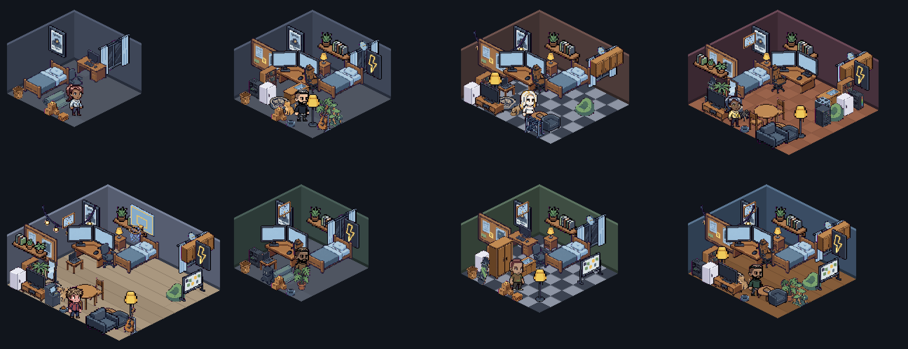

# Изометрический слой: комнаты, люди, питомцы, офисы



Один и тот же движок рисует комнату игрока (`IsoRoom`), офис компании (`IsoOffice`) и
карточку шеринга (`ShareCard`). Ниже — как устроен конвейер и где что править.

## 1. Проекция

Дметрия 2:1, тайл `32×16`, высота стены `72`.

```
screenX = origin.x + (gx - gy) * 16
screenY = origin.y + (gx + gy) * 8
origin  = { x: MARGIN.x + depth * 16, y: MARGIN.top + wallH }
```

Порядок отрисовки — сортировка по `gx + gy` (`layout()` в `components/iso/geometry.ts`).
Напольный спрайт «стоит» нижним углом в клетке `(gx + w, gy + d)`, стены получают
глубину `-1000`, плоские наклейки (ковёр, миска) — смещение `-0.5`, чтобы не спорить
с мебелью в той же клетке. Крупные предметы нельзя ставить в крайние клетки: их
основание вылезет за пол.

## 2. Библиотека спрайтов

`packages/client/public/iso/` — 104 PNG плюс `manifest.json`:

```jsonc
{
  "tile": { "w": 32, "h": 16, "wallH": 72 },
  "sprites": {
    "bed_single": { "file": "bed_single.png", "w": 96, "h": 72, "kind": "floor", "tiles": [2, 3] },
    "char_a03":   { "file": "char_a03.png",   "w": 40, "h": 88, "kind": "char",
                    "roles": { "skin": ["#6b4a35", "#a9714f", "#d3a07a"], "hair": ["#2b2118", "#4a382a"] } }
  }
}
```

`roles` — это рампы: исходные hex спрайта, отсортированные по яркости. Рантайм
подменяет их на рампу целевого цвета (`components/iso/recolor.ts`), растягивая её
между `#1e2430` и `#fff6e2`. Замена идёт по точному RGB, поэтому цветовые роли
извлекаются **до** квантования палитры, а обводка и альфа не трогаются.

Роли персонажа: `skin`, `hair`, `top`, `bottom`, `shoes`. Роль животного: `coat`.
На 19 базовых силуэтах это даёт ≈547 000 внешностей.

## 3. Конвейер ассетов (`tools/isogen`)

```bash
# 1) нарезать сгенерированный лист на отдельные спрайты
node tools/isogen/slice.mjs tools/isogen/raw/pets2.png /tmp/iso/slices --min 700 --gap 8
# 2) прописать нарезки в tools/isogen/catalogue.json (id, kind, tiles)
# 3) собрать public/iso + manifest.json
node tools/isogen/build.mjs /tmp/iso/slices
# 4) посмотреть результат офлайн, без браузера
npx tsx tools/isogen/preview.ts        /tmp/iso/rooms.png  --scale 2 --cols 4
npx tsx tools/isogen/preview-office.ts /tmp/iso/office.png --scale 2
npx tsx tools/isogen/preview-people.ts /tmp/iso/people.png --count 36 --scale 3 --cols 12
```

`build.mjs` делает де-фриндж (магента-фон), тримминг, ресайз под сетку, квантование
палитры и извлечение цветовых ролей.

Классификация ролей работает по гистограмме: пиксели темнее `lum < 24` считаются
обводкой и пропускаются; для остальных копится распределение по четырём полосам
высоты (голова / торс / ноги / обувь). Цвет, размазанный по всей фигуре
(`focus < 0.6`), — структурный, он не перекрашивается. Кожа отделяется по оттенку
(`r > g ≥ b`, hue 8–48), тёмная причёска — по правилу «верхняя полоса и заметно
темнее самой светлой кожи», бежевый свитер — по доле пикселей в торсе.

Промпт, которым генерятся листы, лежит в комментарии к `tools/isogen/catalogue.json`;
главное в нём — «2:1 dimetric isometric projection, all objects share the exact same
viewing angle and scale, solid flat magenta background #ff00ff».

## 4. Что из чего собирается

| Слой | Файл | Правила |
|---|---|---|
| Комната | `iso/scene.ts` | размер 6×6 … 10×9 по `housingLevel`, зеркалится по seed; мебель гейтится жильём, инвентарём и скиллами (полка ≥ 20, доска ≥ 40, диплом ≥ 30) |
| Отделка | `shared/engine/isoFinishes.ts` | 12 красок × 10 полов с паттернами; `tiers` ограничивают выбор по жилью, `null` = авто по seed |
| Внешность | `shared/engine/isoLook.ts` + `iso/palette.ts` | 6 тонов кожи, 10 цветов волос, 12 верха, 8 низа, 5 обуви; выбор игрока перекрывает seed |
| Питомец | `iso/scene.ts` | поза `sleep`/`eat`/`play` по `petFedToday`, рядом миска — пустая или полная |
| Офис | `iso/office.ts` | garage / cowork / product / corp, 7×6 … 11×9, ночная палитра, коллеги из того же генератора людей |

Цвета внешности меняются бесплатно (`customize_avatar` на сервере принимает
`skin/hairColor/topColor/bottomColor/shoeColor` без списания денег и валидирует hex
по палитре), перекраска стен и пола стоит `REPAINT_COST = 500`.
