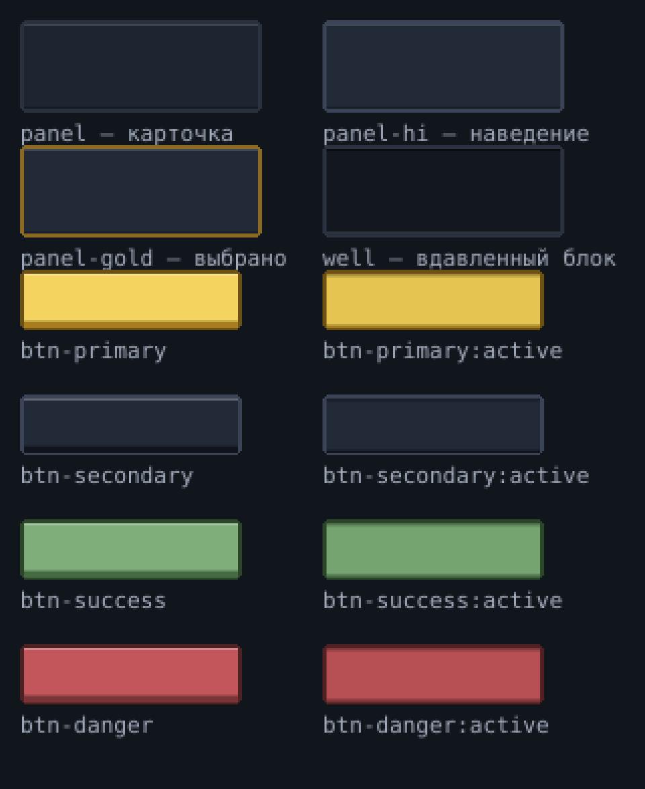
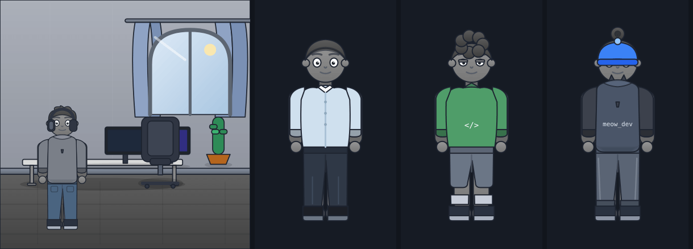

# Интерфейс: визуальная система клиента

Документ описывает **как выглядит мини-апп** и по каким правилам добавляются новые
экраны. Дополняет [design.md](design.md) (что рисуем: комнаты, аватары, офис) и
[pixel-art.md](pixel-art.md) (как рисуем спрайты).

Источник истины в коде:

| Что                                            | Файл                                                             |
| ---------------------------------------------- | ---------------------------------------------------------------- |
| Палитра, радиусы, типо-шкала (Tailwind-токены) | `packages/client/tailwind.config.js`                             |
| CSS-переменные и классы компонентов            | `packages/client/src/index.css`                                  |
| Пиксельные иконки (12×12)                      | `packages/client/src/components/pixel/icons.ts`                  |
| Рендер иконок и пиксельного текста             | `packages/client/src/components/pixel/{PixelIcon,PixelText}.tsx` |
| Общие примитивы UI                             | `packages/client/src/components/ui.tsx`                          |

---

## 1. Идея

Игра про жизнь IT-специалиста, нарисованная пиксель-артом при тёплом свете
настольной лампы. Интерфейс — это **рама вокруг картинки**, а не второй источник
шума. Отсюда пять правил, которым подчиняется всё остальное:

1. **Цвет берём из спрайтов.** Палитра собрана из 131 SVG-слоя комнат и аватаров,
   а не из дефолтного Tailwind. Поэтому UI и арт не спорят друг с другом.
2. **Меню собраны как комнаты.** Плоская плашка, рамка 2px, срезанные (не
   скруглённые) углы, одна светлая пиксельная кромка сверху и тёмная снизу —
   ровно так же, как нарисованы стены и мебель. Никакого стекла, блюра,
   свечения и градиентов.
3. **Один громкий акцент.** Золотой (`--gold`) значит «здесь действие». Всё
   остальное — приглушённое. Если на экране два золотых элемента, один из них лишний.
4. **Иконки вместо эмодзи в хроме.** Эмодзи рендерятся по-разному на iOS, Android
   и в вебе, и именно они дают ощущение «сгенерировано за пять минут». Хром
   (вкладки, статусы, стрелки, метки) собран на собственных 12×12-иконках.
   Эмодзи остаются только как _контент_ (иконка навыка, товара, ачивки) и всегда
   живут в рамке `EmojiToken`.
5. **Движение функционально.** 120–220 мс, только вход элемента и обратная связь
   на нажатие. Никаких бесконечных «плаваний» и переливающихся градиентов;
   всё выключается при `prefers-reduced-motion`.

---

## 2. Палитра

Базовый нейтрал — «чернила» (ink), холодно-синий графит из теней спрайтов.

| Токен                                                    | HEX                   | Роль                                         |
| -------------------------------------------------------- | --------------------- | -------------------------------------------- |
| `--bg`                                                   | `#11151c`             | фон приложения, `theme-color` в `index.html` |
| `--bg-raise`                                             | `#161b24`             | шапка, таббар                                |
| `--surface`                                              | `#1e2430`             | панели и карточки                            |
| `--well`                                                 | глубже панели         | вложенные блоки, дорожки метров              |
| `--line` / `--line-strong`                               | `#2a3240` / `#3a4456` | границы                                      |
| `--text` / `--text-dim` / `--text-mute` / `--text-faint` | `#e9edf4` → `#5c6575` | четыре ступени текста                        |

Акценты — по одному смыслу на цвет, никогда «для красоты»:

| Токен   | HEX       | Значение                                   |
| ------- | --------- | ------------------------------------------ |
| `gold`  | `#f4d35e` | действие, CTA, активная вкладка, репутация |
| `sky`   | `#a9c6e0` | энергия, нейтральная информация            |
| `moss`  | `#7fae7a` | деньги, успех, «получилось»                |
| `ochre` | `#d99a4e` | мотивация, предупреждение                  |
| `clay`  | `#c2565a` | здоровье на нуле, опасность, удаление      |
| `wood`  | `#b98d60` | тёплый нейтрал (заменил фиолетовый)        |

**Важно:** в `tailwind.config.js` стандартные палитры переопределены на наши
(`slate/gray/zinc/neutral/stone → ink`, `blue/cyan/teal/indigo/primary → sky`,
`emerald/green/lime → moss`, `amber/yellow → gold`, `orange → ochre`,
`red/rose/pink → clay`, `violet/purple/fuchsia → wood`, `white → #e9edf4`).
Это страховка: даже если в новом коде окажется `bg-slate-800`, экран останется
в палитре игры. Но писать в новом коде нужно семантические имена — `bg-ink-800`.

---

## 3. Форма и ритм

- **Радиусов нет.** `--radius-panel` и `--radius-control` равны нулю: в арте нет
  скруглений, значит их нет и в интерфейсе. Угол «срезан» сам собой — рамка
  рисуется четырьмя смещёнными тенями (`0 ±2px`, `±2px 0`), и угловой пиксель
  остаётся пустым, как у рисованной спрайтовой рамки. Готовый набор теней лежит
  в классе `.pixel-frame`.
- **Кнопка — клавиша.** Под `.btn-primary/-secondary/-success/-danger` лежит
  «плечо» 3px; нажатие опускает кнопку на него (`translateY(3px)`), и это вся
  анимация.
- **Отступы:** шаг 4px; внутри панели 12px, между блоками 12–16px.
- **Тап-таргет:** `--tap: 44px`, вынесен в `.btn` и `.touch-target`.
- **Ширина:** `.app-container` ограничен 480px, на десктопе с боковыми линиями.
- **Числа:** класс `.num` включает `tabular-nums` — счётчики денег и энергии
  не «дёргают» строку при изменении.
- **Типографика:** системный стек (веб-шрифты недоступны в проде Telegram без
  внешней загрузки). Различие даёт шкала: `2xs` 10 / `xs` 12 / `sm` 13 /
  `base` 15 / `lg` 17 / `xl` 20 / `2xl` 24 / `3xl` 28 и трекинг заголовков.

---

## 4. Компоненты (`index.css`)

| Класс                                                     | Когда                                                                                              |
| --------------------------------------------------------- | -------------------------------------------------------------------------------------------------- |
| `.panel` / `.game-card`                                   | статичный блок контента                                                                            |
| `.tile`                                                   | то же, но кликабельное (есть hover/active)                                                         |
| `.well`                                                   | вложенный блок внутри панели                                                                       |
| `.pixel-frame`                                            | рамка 2px со срезанными углами, если плашку собираешь руками                                       |
| `.panel-note[-gold\|-sky\|-moss\|-clay\|-ochre]`          | акцентная полоса 3px слева — единственный способ «подсветить» панель                               |
| `.eyebrow` / `.section-title`                             | заголовок секции: 11px, caps, трекинг, пунктирная пиксельная линия справа                          |
| `.divider`                                                | разделитель: пунктир 2px через 2px                                                                 |
| `.btn[-primary\|-secondary\|-ghost\|-success\|-danger]`   | кнопки; `-primary` золотая, на экране одна                                                         |
| `.btn-lg`                                                 | главное обязательство экрана: «Начать игру», «Завершить день» (56px)                               |
| `.tile-action` / `.tile-icon`                             | действие дня: иконка на вдавленной плашке, цена под названием                                      |
| `.gain-stream` / `.gain-float` / `.num-pop`               | выплата: `+N` улетает вверх, изменившийся счётчик подпрыгивает                                     |
| `.chip`, `.stat-pill`                                     | метки и мини-статусы                                                                               |
| `.meter` + `<span>` внутри                                | прогресс 4px; заливка разбита маской на пиксельные ячейки 3px через 1px                            |
| `.tabbar`, `.tabbar-item`, `.tabbar-label`, `.tabbar-dot` | нижняя навигация 54px; активная вкладка — золотая плашка `panel-gold`; точка = что-то ждёт (оффер) |
| `.accordion-body/.accordion-inner/.accordion-chevron`     | раскрытие через `grid-template-rows` (без прыжков высоты)                                          |
| `.sticky-cta`                                             | закреплённая кнопка внизу, когда MainButton недоступен                                             |
| `.animate-fade-in / -pop-in / -slide-up / -pulse-soft`    | разрешённые анимации                                                                               |
| `.pixelated`                                              | для `` со спрайтом, который показывают в масштабе ≥ 1:1                                       |

`.animate-float` и `.animate-gradient` оставлены как no-op: старая разметка не
ломается, но плавающих эмодзи и переливов больше нет.

Фон приложения — не заливка, а тот же дизеринг, которым затенены стены: точка
`rgba(233,237,244,.028)` с шагом 4px.

### 9-slice рамки (`public/ui/`, генератор `tools/uigen/build.mjs`)

Панели и кнопки — не CSS-бордеры, а нарисованные попиксельно PNG, растянутые
через `border-image`. Плашки 12×12 со slice 4 (`panel`, `panel-hi`,
`panel-gold`, `well`), кнопки 12×14 со slice `4 4 5 4` — нижние 3px это
«плечо», на которое клавиша садится при нажатии (`btn-{gold,dark,moss,clay}`
плюс кадр `-down`). Правило 9-slice: тянущаяся середина обязана быть
однородной, иначе блик размажется — поэтому весь декор живёт в углах.

```css
.panel {
  border: 4px solid transparent;
  border-image: url('/ui/panel.png') 4 fill stretch;
}
.btn-primary {
  border-width: 4px 4px 5px;
  border-image: url('/ui/btn-gold.png') 4 4 5 4 fill stretch;
}
.btn-primary:active {
  border-image-source: url('/ui/btn-gold-down.png');
  transform: translateY(2px);
}
```

Перегенерация: `node tools/uigen/build.mjs`. Контрольный лист (каждая рамка
растянута до боевого размера, ×3) — `node tools/uigen/sheet.mjs`:



### Обратная связь как в кликерах

Жанр держится на трёх правилах, и UI им следует: отклик на тап меньше 50 мс
(нажатие кнопки — смена кадра, `steps(2,end)`), выплата показывается там, куда
смотрит игрок (`diffGains` в сторе сравнивает состояние до/после действия,
`GainStream` пускает `+120 ₽`, `−3` энергии и новые уровни навыков вверх
экрана), а счётчик, который изменился, подпрыгивает до 1.22× (`usePop` в
`ResourceBar`). Всё это выключается при `prefers-reduced-motion`.

### Спрайты игры в меню

`components/iso/IsoIcon.tsx` рисует любой спрайт из `/iso/` как иконку, а
`ITEM_SPRITE` связывает товары из `items.json` с этими спрайтами: в магазине
видно **тот самый** стул, который появится в комнате. `SpriteBadge`
(`components/ui.tsx`) — эмблема экрана: магазин озаглавлен ящиками, навыки —
книжной полкой, карьера — доской. Иконкам намеренно не ставят
`image-rendering: pixelated`: кровать шириной 130px, ужатая в 44px, потеряла бы
обводку; внутри комнаты, где масштаб ≥ 1:1, режим остаётся пиксельным
(`useRenderMode`).

---

## 5. Пиксельные иконки

`icons.ts` — 41 иконка в виде ASCII-сетки: 12 строк по 12 символов,
`#` — 100% `currentColor`, `+` — 45%, `.` — прозрачно.

```tsx
<PixelIcon name="bolt" size={16} className="text-gold-300" title="Энергия" />
<PixelText scale={4}>IT LIFE</PixelText>   {/* пиксельный вордмарк меню */}
```

Иконка наследует цвет текста, рендерится в `<svg>` целыми пикселями и одинаково
выглядит на любом устройстве. Набор: `bolt heart flame star calendar book
briefcase house bag trophy chart screen cap laptop globe chat moon rocket code
sleep walk mug dice dumbbell people box car chip target bone clock lock check
warn chevron arrow gear person play plus coin`.

**Тест** `src/components/pixel/__tests__/icons.test.ts` проверяет, что каждая
иконка — валидная сетка 12×12 из разрешённых символов и не пустая. Запуск:
`npm run test -w packages/client`.

Как добавить иконку:

1. дописать 12 строк в `PIXEL_ICONS`;
2. отрисовать контактный лист и посмотреть глазами (иконка должна читаться при 12px);
3. прогнать тест.

---

## 6. Примитивы (`components/ui.tsx`)

- `Spinner`, `Skeleton`, `RoomSkeleton` — загрузка (скелетон повторяет пропорции комнаты);
- `EmptyState({ icon, title, hint })` — `icon` это **имя пиксельной иконки**, не эмодзи;
- `ScreenTitle({ icon, children, meta })` — единая шапка экрана;
- `EmojiToken` — рамка 24×24 для контентного эмодзи (навык, товар, ачивка);
  незаработанное показывается через `grayscale`.

---

## 7. Telegram

- Тёмный chrome выставляется через `applyTelegramChrome()` (`lib/telegram.ts`):
  `setHeaderColor` / `setBackgroundColor` = `#11151c`, тот же цвет в
  `<meta name="theme-color">`.
- Главное действие дня — нативный **MainButton**; `.sticky-cta` включается только
  в браузере, где MainButton нет.
- **BackButton**: вкладка → «День» → меню → скрыта.
- Хаптика: табы и выбор — `selection`, действие — `tap`, покупка и конец дня —
  `medium`, оффер/ачивка — `success`, отказ — `error`.
- Safe-area учитывается через `env(safe-area-inset-*)` в `.app-container`.

---

## 8. Персонаж и навигация

### 8.1. Персонаж — в полный рост



Игрок рисуется **целой фигурой**, а не портретом: голова, торс с рукавами,
штаны и обувь. Холст слоёв — `500×760` (объявлен в
`packages/content/layers/avatar_manifest.json` → `resolution`), компоненты берут
пропорцию оттуда, а не предполагают квадрат.

Слоты манифеста: `body` (кожа, тело, ноги — тонируется генетикой) → `bottom`
(штаны и обувь) → `eyes` → `hair` → `beard` → `top` (кофта с рукавами) →
`accessory`.

- `bottom` — полноценный слот гардероба: джинсы, спортивки, шорты доступны
  сразу, чиносы — с работой, костюмные — с жильём 2+ или грейдом Senior.
  Смена стоит `PANTS_COST` (1500 ₽). Правила — в
  `packages/shared/src/engine/avatarCustom.ts`, тесты — в
  `src/engine/__tests__/avatarCustom.test.ts`.
- Фигура стоит на полу: в комнате `left-[6%] bottom-[5%] w-[38%]`, в офисе —
  у своего стола. Не центрировать и не растягивать: рост персонажа — часть
  масштаба сцены.
- **Пиксельный аватар 32×32 — это портрет**, и живёт он только в карточке
  идентичности (`PixelIdentity`) и на шар-карточке. В комнате и офисе всегда
  векторная фигура: она нарисована в том же стиле, что и мебель.

### 8.2. Навигация

Нижних вкладок **четыре** — по одной на каждый круг игрового цикла:
«День», «Навыки», «Карьера», «Дом». Пятая кнопка «Ещё» открывает лист с
редкими разделами (Магазин, Трофеи, Топ, Офис). Семь равнозначных вкладок
делали все семь одинаково неважными.

Правило: вкладка — это то, куда игрок заходит каждый день. Всё остальное — в
«Ещё» или внутрь соответствующего экрана.

Лист «Ещё» — **хаб-список, а не полка**: каждый раздел — отдельная строка с
якорной иконкой слева, подписью и подсказкой; текущий раздел помечен золотой
планкой и словом «здесь». Одна строка = одно место, взгляд сканирует четыре
реальных раздела, а не четыре одинаковые плитки.

Шапка-табло (`ResourceBar`) держит **одну иерархию, а не витрину**: деньги —
самое крупное число бара (золотая монета, крупный кегль), день — тихий
контекст слева, грейд — спокойный чип справа. Метры постоянного HUD — только
три «ресурса решения»: энергия (валюта действий), здоровье и мотивация.
Репутация и рейтинг лидерборда показываются контекстно — в карточке карьерного
гейта, в «Топе» и в ачивках, а не висят в баре двумя золотыми звёздами.

Главное меню — один экран с одним действием: комната с персонажем, вордмарк,
строка «День · грейд · деньги» и кнопка «Продолжить». Второстепенное — двумя
тихими ссылками, без плиток и без неактивных кнопок.

### 8.3. Дерево навыков — одна карта-созвездие

Вкладка «Навыки» — **одна карта всей игры**, Path-of-Exile-стайл: никаких
подразделов-веток и никакой сетки. `skills.json` — лес связанных деревьев
(школы требуют друг друга: AI/ML висит на backend-`python`, blockchain — на
frontend-`javascript`, кибербез — на devops-`linux`); весь граф — одно поле,
которое тащат и зумируют.

Раскладка — `screens/skillTreeLayout.ts`, функция `layoutGalaxy()`:

- каждая школа-корень — **центр своего радиального дерева**: дети растут на
  кольцах наружу, родитель всегда ближе к центру, чем потомки, а каждый ребёнок
  занимает угловой «кусок», пропорциональный листьям своей ветки — ноды одной
  рощи физически не пересекаются;
- корни разбрасываются **золотой спиралью** (как семечки подсолнуха), каждая
  роща — по своему радиусу, поэтому нет ни выровненных колонок, ни рядов;
- рёбра — **кубические Безье с боковым изгибом** (пути вьются, а не ходят
  прямыми «локтями»), как настоящие скилл-паты в RPG.

Вьюпорт карты (`SkillMap` в `screens/SkillsView.tsx`): скролл — панорама
(мышь — drag, тач — свайп), колесо/кнопки — зум, «⌂» — показать всё дерево.
При зуме точка под курсором остаётся на месте; процент масштаба виден в углу.
Фон карты — редкая пиксельная «пыль», чтобы пустота читалась как космос,
а не как чистый лист.

Вьюпорт карты (`SkillMap` в `screens/SkillsView.tsx`): скролл — панорама
(мышь — drag, тач — свайп), колесо/кнопки — зум, «⌂» — показать всё дерево.
При зуме точка под курсором остаётся на месте; процент масштаба виден в углу.

PoE-инструменты вокруг той же карты:

- **Старт с основного навыка.** Первый кадр открывает всё дерево, отцентрованное
  по ноде твоего основного навыка (⌂ возвращает к центру холста).
- **Фильтр школ.** Строка чипов над картой — «линза», а не подразделы: выбранная
  школа остаётся яркой, остальные ноды и рёбра приглушаются (`opacity 0.15`,
  некликабельны). Чужой родитель-гейт (например, python для AI/ML) виден
  приглушённым — понятно, что и где открыть.
- **Мини-карта** (кнопка «▦»): всё дерево в углу — точки по состояниям нод
  (золотая = основной, зелёные = выучены), рамка показывает текущий вьюпорт и
  живёт при панораме/зуме; тап или drag по мини-карте прыгает на нужный участок.
- Подпись внизу меняется: «одно дерево всех школ» ⇄ «показана школа …».

Состояния ноды (ровно по акцентным цветам):

| Состояние            | Рамка                           | Что показано                  |
| -------------------- | ------------------------------- | ----------------------------- |
| выучен (`level > 0`) | `moss`                          | тонкий XP-бар + уровень       |
| доступен (уровень 0) | нейтральная                     | тап — сделать основным        |
| основной навык       | `gold` + маркер-мишень          | качается учёбой и работой     |
| заперт               | тёмная, пунктирное ребро, замок | подпись «нужно: <родитель> N» |

На мелком зуме (< 0.62) подписи прячутся — остаются рамки и эмодзи, чтобы
обзор не превращался в кашу. Легенда состояний — одна строка под картой.
Soft skills и перки — обычные секции ниже карты (они не часть дерева).

Тест геометрии: `src/screens/__tests__/skillsTree.test.ts` (реальный
`skills.json`: каждый навык ровно один раз и в пределах холста, ноды одной
рощи не сближаются меньше шага кольца, bounding-круги рощ не пересекаются,
ребёнок всегда дальше от корня, чем его родитель).

---

## 9. Чек-лист для нового экрана

- [ ] Заголовок через `ScreenTitle` с пиксельной иконкой.
- [ ] Секции — `.eyebrow`, без эмодзи в тексте заголовка.
- [ ] Блоки — `.panel`, кликабельные — `.tile`, вложенные — `.well`.
- [ ] Ровно одна `.btn-primary` на экран; остальные `-secondary` / `-ghost`.
- [ ] Акцент только полосой `.panel-note-*`, не заливкой и не тенью.
- [ ] Все числа в `.num`.
- [ ] Иконки хрома — `PixelIcon`; контентные эмодзи — `EmojiToken`.
- [ ] Цвета только семантические (`ink/gold/sky/moss/ochre/clay/wood`).
- [ ] Пустое состояние и загрузка описаны (`EmptyState`, `Skeleton`).
- [ ] Персонаж, если он есть на экране, — в полный рост (`ProceduralAvatar`).
- [ ] `npx tsc -p packages/client --noEmit`, `npm run lint`, `npm run test -w packages/client`.
